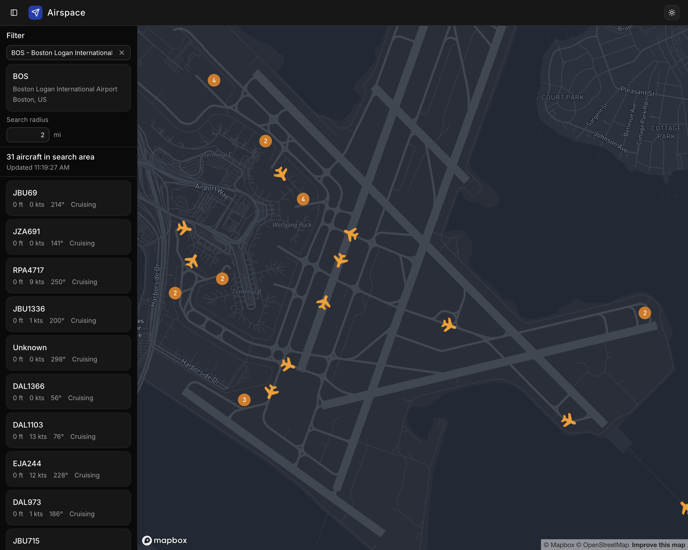
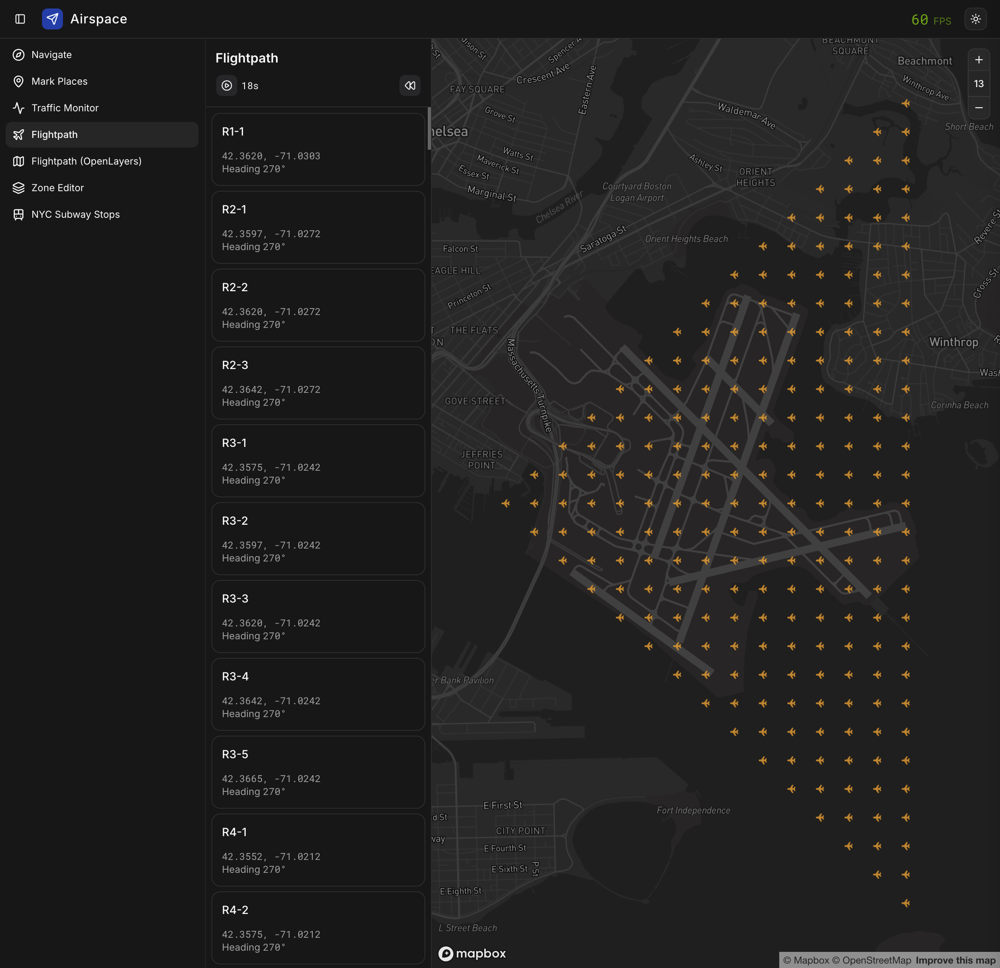

# Airspace

An evolving lab for geospatial and autonomous systems UI.

**Tech Stack**

1. Framework: React 19 + Vite 7 + React Router 7 + Base UI
2. Styling: shadcn/ui + TailwindCSS 4
3. Mapping: Mapbox





## Prerequisites for development

1. Install [Node Version Manager](https://github.com/nvm-sh/nvm) (nvm). It
   allows using different versions of node via the command line
2. Run `nvm use` to use the required version of node.
3. Run `pnpm i` to install required packages.

## Development Build

```shell
pnpm dev
```

Now point your browser to http://localhost:3000

## Production Build

```shell
pnpm build
pnpm preview
```

Now point your browser to http://localhost:3000

## All Commands

```
pnpm build            # builds the prod bundle
pnpm clean            # deletes all build artifacts
pnpm dev              # runs the dev build
pnpm fix              # lints, formats and attempts to fix any issues (requires `pnpm build` has been ran)
pnpm lint             # runs the linter, useful for debugging lint issues (generally `pnpm fix` is preferred)
pnpm preview          # runs the prod build
```

## Learning: Mapbox and Three.js

Short notes from building this lab – enough to orient newcomers to Mapbox GL JS,
Three.js, and how Threebox’s `CameraSync` approaches embedding Three.js on a map
(distinct from some in-repo integration experiments).

| Article                                                     | What it covers                                                                              |
| ----------------------------------------------------------- | ------------------------------------------------------------------------------------------- |
| [Mapbox 101](docs/mapbox-101.md)                            | Styles, sources vs layers, GeoJSON, 3D-first mental model, “2D” as orthographic + top-down  |
| [Three.js 101](docs/threejs-101.md)                         | Scene, camera, meshes, renderer, coordinates in plain language                              |
| [Using Three.js in Mapbox](docs/using-threejs-in-mapbox.md) | Shared WebGL context, custom layers, Threebox `CameraSync` and why explicit near/far matter |
